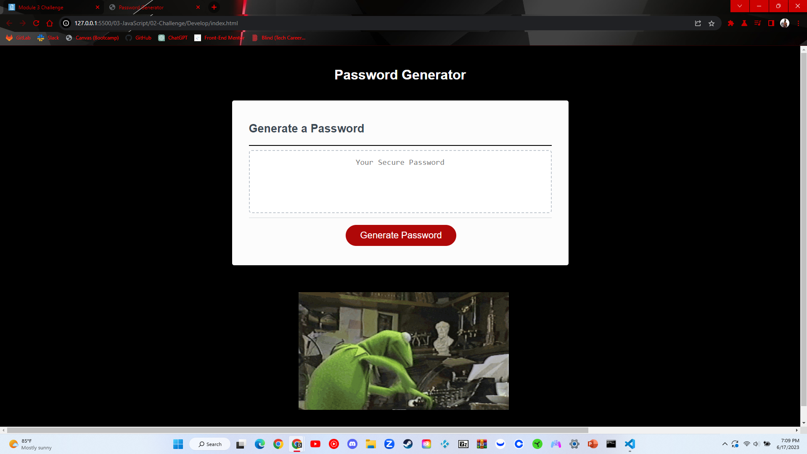

# Password Generator

This is a simple password generator web application that allows users to generate random passwords based on their preferences for character length and character types.

## Descripion

- Generates random passwords with customizable character length (between 8 and 128 characters).
- Allows users to select the inclusion of lowercase letters, uppercase letters, special characters, and numbers in their passwords.
- Provides a user-friendly interface with a "Generate Password" button.

## Screenshot

## Code Source!
You can find a video tutorial for this project on YouTube: [Password Generator Tutorial](https://youtu.be/v2jfGo7ztm8)

## Link to Deployed Application

